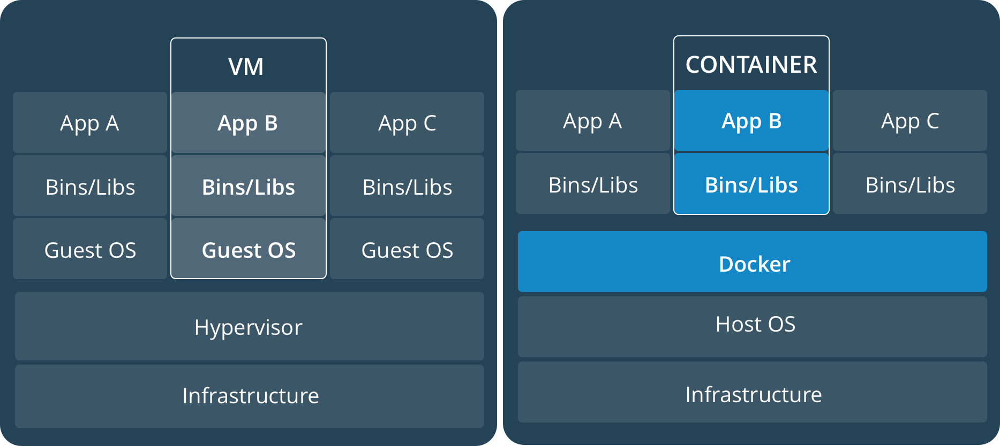

# Docker

## ¿Qué es Docker?

Docker es una plataforma de virtualización a nivel de sistema operativo, que emplea una tecnología denominada *linux contenedores* para crear una especie de "máquinas virtuales" (**contenedores**) muy ligeros. Además es una suite de herramientas para gestionar estos contenedores, conectarlos entre sí, copiarlos, desplegarlos en diferentes arquitecturas, etc.

Con Docker podemos facilitarnos la vida si tenemos alguna de las siguientes tareas:

* Instalar aplicaciones con dependencias complejas fácilmente sin "ensuciar" el sistema operativo.
* Mantener varias versiones de una misma aplicación aisladas unas de otras.
* Usar aplicaciones de Linux en cualquier sistema operativo.
* Definir un entorno de desarrollo portable y aislado del sistema particular de cada desarrollador.
* Garantizar que el entorno de desarrollo simule exactamente el entorno de producción para evitar errores de configuración o dependencias en el despliegue.
* Desplegar en una multitud de arquitecturas diferentes sin necesidad de una configuración particular para cada una.
* Desplegar automáticamente una aplicación en función del uso (por ejemplo, para darle a cada estudiante una "máquina fresca" donde trabajar al inicio de cada clase).

## ¿En qué se diferencia Docker de una máquina virtual?

A grandes razgos, estas son las diferencias fundamentales:

* Una máquina virtual requiere mayores recursos, pues tiene que virtualizar desde el sistema operativo hasta la aplicación, mientras que un contenedor es mucho más ligero, porque todos los contenedores comparten el mismo sistema operativo.
* Por las mismas razones, una máquina virtual es más pesada de encender y apagar, mientras que un contenedor enciende y apaga en segundos.
* En una máquina virtual es más complejo configurar como compartir la red, o el sistema de ficheros, tanto con el *host* como con otras máquinas virtuales.
* Un contenedor por defecto es una copia temporal de una imagen, lo que significa que al apagar el contenedor los cambios realizados se pierden (aunque pueden guardarse). Esto es muy útil para hacer pruebas de integración. Esta separación entre contenedor e imagen es fundamental en docker.
* Una imagen de una máquina virtual es un archivo binario difícil de compartir. En cambio, una imagen de Docker se define por un archivo de texto `Dockerfile` que puede ser chequeado en el repositorio de control de versiones. De esta forma, la propia arquitectura de una aplicación queda documentada formalmente en el código fuente, y puede replicarse de forma autómatica.
* El control por línea de comandos de `docker` permite gestionar rápidamente todos los contenedores e imágenes, no solo a un usuario humano, sino mediante scripts. Esto permite crear infraestructuras que se despliegan automáticamente cuando es necesario (por ejemplo, a petición de un usuario a través de una interfaz web).
* Existe un banco de imágenes inmenso creado por la comunidad con multitud de entornos y aplicaciones. Si una herramienta cualquiera es medianamente popular, alguien habrá publicado ya una imagen.



### Un ejemplo

* Antonio tiene en su máquina instalado `Java 7` que lo usa diariamente para sus desarrollos.
* Jose tiene en su máquina `Java 8`.
* Antonio quiere que Jose pruebe su aplicación, pero para ello Jose tendrá que instalar `Java 7`, cambiar su configuración de `$PATH` y esto posiblemente entrará en conflicto con su otra instalación.
* Para colmo de males, Jose trabaja en Windows 10 pero la aplicación de Antonio solo ha sido probada en Ubuntu.

Con `docker` esta situación no es ningún problema, Antonio simplemente le da a Jose el arhivo `Dockerfile` (o directamente la imagen) y Jose puede probar la aplicación en un entorno aislado, seguro, e idéntico al que Antonio utiliza.

## Docker para usuarios

### Instalando `docker`

Antes de comenzar, aquí hay unos *links* con las guías de instalación oficiales:

* **Windows**: [https://docs.docker.com/docker-for-windows/install/](https://docs.docker.com/docker-for-windows/install/)
* **Mac OS**: [https://docs.docker.com/docker-for-mac/install/](https://docs.docker.com/docker-for-mac/install/)
* **Linux (Ubuntu)**: [https://docs.docker.com/install/linux/docker-ce/ubuntu/](https://docs.docker.com/install/linux/docker-ce/ubuntu/)

### Usando `docker` para ejecutar una aplicación

Supongamos que queremos instalar la aplicación `LETO` desarrollada por el GPLSI. Esta aplicación tiene varias dependencias complejas: muchas bibliotecas pesadas de Python (entre ellas `tensorflow`), y una configuración bastante compleja. Afortunadamente, la aplicación está publicada en el [repositorio público oficial de Docker](https://hub.docker.com).

Un usuario que quiera instalarse esta aplicación solo debe descargarla:

```bash
docker pull gplsi/leto
```

Una vez descargada la aplicación, se ejecuta con:

```bash
docker run [opciones] gplsi/leto [comando]
```

Donde `[comando]` es un comando de inicialización propio de la aplicación, y `[opciones]` son opciones de `docker` que nos permiten definir cómo el contenedor se comunica con el *host*, si se monta una carpeta virtual, entre otras. Cada desarrollador documentará cómo usar su imagen concreta. En este caso, el comando a utilizar levanta la interfaz web de la aplicación:

```bash
docker run -p 5000:5000 gplsi/leto python /leto/leto-ui/app.py
```

La opción `-p 5000:5000` indica que el puerto `5000` dentro del contenedor se enlaza al puerto `5000` del *host*. Luego visitamos en un navegador [http://localhost:5000](http://localhost:5000) y ya está. Si los desarrolladores quisieran, pudieran haber pre-configurado la imagen de modo que solo hacer `docker run` ya estuvieran pre-definido los puertos y comandos necesarios.

De esta forma podemos utilizar aplicaciones complejas con muchas dependencias sin necesidad de instalarnos niguna, siempre y cuando la imagen esté adecuadamente construida.

### Usar `Linux` en cualquier lugar

Una imagen particularmente útil es cualquier imagen de Linux, por ejemplo `Ubuntu`. Si nos descargamos esta imagen tenemos una versión *dockerizada* de Ubuntu lista para ser utilizada en cualquier SO.

```bash
docker pull ubuntu
```

Una vez obtenida la imagen, podemos abrir una consola de `bash` en Ubuntu con este comando:

```bash
$ docker run -it ubuntu bash

root@2d4995fe3d48:/# Aquí estamos dentro del contenedor
root@2d4995fe3d48:/# ls
bin   dev  home  lib64  mnt  proc  run   srv  tmp  var
boot  etc  lib   media  opt  root  sbin  sys  usr
root@2d4995fe3d48:/#
```

Si vemos en otra consola el consumo de este contenedor, veremos que solo usa un 2 MB de RAM! En comparación con una máquina virtual de Ubuntu, que tendría al menos 512 MB de RAM ocupados solo por tener Ubuntu encendido.

```bash
$ docker stats --no-stream

contenedor         CPU %      MEM USAGE / LIMIT     MEM % ...
2d4995fe3d48      0.00%      1.555MiB / 7.7GiB     0.02% ...
```

Claro que en este Ubuntu no tenemos nada instalado, ni siquiera interfaz gráfica. Solo una consola de `bash` y lo más básico del sistema operativo. Pero ya podemos entrar y ejecutar `apt-get install ...` según necesitemos.

> **NOTA**: Hemos dicho anteriormente que los contenedores son como copias temporales de una imagen y que los cambios realizados se pierden al salir. Esto no es del todo cierto, pues cuando se sale de contenedor, este se **apaga** pero no se **destruye**. Solo al destruirlo es que se pierden los cambios. Si queremos que los cambios persistan en la imagen tenemos que hacer `docker commit <contenedor>` y entonces los cambios se escribirán en una **nueva imagen**, aunque solo usará el espacio adicional que requiera para los cambios (las imágenes *heredan* de otras imágenes, y se crea una *jerarquía de imágenes*).

## Docker para desarrolladores

Para un equipo de desarrollo trabajando en un proyecto complejo `docker` puede ser una gran ayuda para garantizar que todo el equipo tiene las dependencias actualizadas, y que todo el código siempre está probado sobre la misma plataforma donde será desplegado.

Con `docker` queremos garantizar lo siguiente:
* Todos los desarrolladores tienen el mismo entorno de desarrollo.
* El entorno de desarrollo y el de ejecución en producción siempre son compatibles (en términos de configuración y dependencias).
* Toda característica del entorno de ejecución es expresada en código ejecutable, no en documentación que se queda atrasada rápidamente.
* Cualquier cambio de configuración, nueva dependencia, etc., en el entorno, queda registrada en el control de versiones, haciendo imposible que un desarrollador se quede atrás.
* Es posible replicar automáticamente el entorno en cualquier plataforma, en particular en un servidor de integración continua (CI), para garantizar que los *tests* siempre están al día.

Para lograr todo esto, tenemos que definir el entorno de ejecución de nuestra aplicación en forma de un `script` ejecutable, versionable y mantenible. Este `script` es el archivo `Dockerfile`, que define de forma unívoca un entorno de ejecución (una **imagen**), de forma que donde quiera que se ejecute este archivo, obtendremos una imagen idéntica.

### Manejando una aplicación

Por ejemplo, si vamos a desarrollar una aplicación de `Python` que requiere `Python 3.6`, y la biblioteca `Flask` (para desarrollar aplicaciones web), nuestro `Dockerfile` pudiera lucir así:

```Dockerfile
FROM python:3.6
RUN pip install --no-cache-dir Flask
COPY ./app /app
EXPOSE 5000
CMD [ "python", "/app/app.py" ]
```

Este archivo describe unívocamente como construir nuestro entorno. La primera línea indica que se *hereda* de una imagen que ya contiene instalado `Python 3.6`. La siguiente línea indica que se ejecute el comando `pip install` con nuestras dependencias. Finalmente copiamos el código fuente para dentro la imagen en la raíz, definimos el puerto que será visible desde fuera del contenedor, y definimos un comando inicial. Luego al hacer `docker run <nuestra-imagen>` se ejecutará automáticamente `python /app/app.py`.

Afortunadamente existen imágenes pre-instaladas de casi todo lo que nos haga falta, pero si no existiera la nuestra, podríamos añadir `RUN apt-get install ...` para instalar todas las dependencias que necesitamos.

> **NOTA**: En el caso particular de `Python` es mejor usar un archivo `requirements.txt` para no tener que añadir una línea `pip install` cada vez que aparezca una nueva dependencia. Cada lenguaje o framework tendrá una forma estándar de manejar dependencias.

Este archivo `Dockerfile` va en nuestro repositorio, generalmente en la raíz, de forma que nuestro proyecto luciría así:

```
.git/
app/
 |-- app.py

.gitignore
Dockerfile
```

El archivo `Dockerfile` es una descripción ejecutable de nuestro de ejecución. Para que cada desarrollador tenga siempre actualizadas las dependencias, simplemente es necesario ejecutar este comando cada vez que cambie el `Dockerfile`:

```bash
docker build -t [tag] .
```

El valor de `[tag]` indica un nombre para la imagen. En este caso:

```bash
docker build -t gplsi/example .
```

Cada vez que haya un cambio en el repositorio y sea necesario actualizar el entorno de ejecución (e.j., porque aparecieron nuevas dependencias), o cada vez que haga falta desplegar una nueva versión, volvemos a correr `docker build ...` y ya está.

> Afortunadamente, no siempre que hagamos `docker build ...` habrá que hacerlo todo. Docker guarda una "capa" (una imagen en sí) por cada comando del `Dockerfile`, por lo que si solo cambiamos comandos al final, o adicionamos nuevos, al hacer `build` se reusa lo anterior. De hecho, si somos disciplinados con no cambiar por gusto el `Dockerfile`, podemos sin preocupación hacer `build` cada vez que hagamos `git pull`, ya que de no haber cambios, no habrá que reconstruir la imagen.

Para ejecutar la aplicación tenemos el comando:

```bash
docker run --rm -p 5000:5000 gplsi/example
```

Que además de enlazar el puerto 5000 indica (`--rm`) que el contenedor se elimine una vez terminada la ejecución, para evitar tener múltiples copias del contenedor "zombies" por ahí.

### Desarrollo en modo "debug"

En muchos casos, durante el desarrollo tenemos un modo "debug", que nos permite iterar más rápidamente, ya sea porque la aplicación se recarga cada vez que hay un cambio, o porque se imprimen más logs, etc.

Una solución fácil para manejar estos casos es tener una opción `--debug` (o similar) en nuestra aplicación, y a través de `docker` pasar el comando adecuado. Por defecto cuando hagamos `docker run ...` ejecutaremos el comando "de producción", pero podemos sobreescribirlo para pasar un comando "de desarrollo":

```bash
docker run --rm -p 5000:5000 gplsi/example python /app/app.py --debug
```

Adicionalmente, durante el desarrollo, es conveniente "montar" la carpeta de código fuente directamente dentro del contenedor, de forma que no haya que reconstruir la imagen cada vez que cambia el código. Para esto haremos uso de los **olúmenes**. De forma muy simplificada un volumen es un punto de montaje en el sistema de ficheros de la imagen donde podemos montar una dirección del *host*:

```bash
docker run --rm -p 5000:5000 -v "`pwd`/app:/app" gplsi/example python /app/app.py --debug
```

Notemos que la sintaxis es un poco complicada porque necesitamos indicar la dirección *host* de forma **absoluta**. Una vez montado un volumen todos los cambios son reflejados en ambos sentidos. Si hacemos cambios en el *host* los veremos en el contenedor y viceversa.

Este es el mecanismo que se usa, por ejemplo, para lograr que el contenido de una base de datos no se pierda cuando se elimina un contenedor, pero tampoco haya que "grabarlo" en la imagen.

> **NOTA**: Estos cambios son reflejados porque literalmente ambas direcciones apuntan al mismo lugar físico en el sistema de fichero. No hay copias innecesarias, por lo que es muy eficiente, incluso si se monta un volumen de un tamaño inmenso, como la carpeta de datos de un sistema de bases de datos.

### Manejando más de un servicio

Hasta ahora hemos tenido una aplicación que solo depende de un servicio (la aplicación en sí), pero generalmente tenemos más de un servicio: un gestor de bases de datos, un servidor web, un servidor de logs, o simplemente más de un servicio que se conectan entre sí.

En Docker es conveniente ver estos servicios distintos como contenedores distintos que se comunican por una interfaz de red virtual (manejada por Docker). De esta forma, nuestra imagen de la aplicación de Python solo tiene el código de Python, y si necesitamos una base de datos, por ejemplo, en MongoDB, entonces descargamos una imagen "pura" de MongoDB, y conectamos ambos contenedores en tiempo de ejecución.

Ahora bien, aunque podemos hacer todo esto directamente con Docker, levantando varios contenedores a la vez y pasando como opciones del comando `docker` los puertos que se conectan a otros puertos, esto puede volverse tedioso rápidamente. Vamos a usar entonces **docker-compose**, una utilidad de orquestación de servicios para Docker.

**Guía de instalación:** [https://docs.docker.com/compose/install/](https://docs.docker.com/compose/install/)

Con `docker-compose` añadiremos un archivo más a la mezcla, que se denomina `docker-compose.yml`, y que describe toda nuestra arquitectura de servicios. Este archivo nos servirá para definir de un golpe qué servicios (imágenes) es necesario levantar, quién se conecta con quién, qué comandos ejecutar, todo en un solo archivo, versionable, reproducible y manejable.

En nuestro ejemplo queremos adicionar una base de datos en MongoDB. Esto generalmente conlleva una instalación complicada, pero con Docker ya sabemos que alguien habrá creado una imagen lista para servir de MongoDB, ¿verdad?

Como no queremos modificar nada de la configuración de MongoDB, solo usar algo que venga pre-configurado, no vamos ni siquiera a necesitar un `Dockerfile`. Veamos entonces como queda nuestro `docker-compose.yml`:

```yaml
version: "3.3"

services:
  app:
    image: gplsi/example
    build: "."
    ports:
      - "5000:5000"
    command: "python /app/app_mongo.py"

  mongo:
    image: mongo
```

En este archivo describimos dos servicios, nuestra applicación y la base de datos MongoDB que usaremos. Al ponerle nombre a los servicios, Docker automáticamente crea una red virtual donde el *hostname* `mongo` responde al IP que tenga asignado el contenedor, por lo que en el código de Python podemos hacer:

```python
client = pymongo.MongoClient("mongo", 27017)
```

Y se resolverá correctamente, aunque los contenedores cambien de IP cada vez que se levanten. De esta forma no tenemos que manejar direcciones IP estáticas, ni DNS, para comunicar nuestros servicios.

Para levantar toda la infraestructura tenemos entonces un comando:

```bash
docker-compose up [-d]
```

La opción `-d` hace que la terminal retorne de inmediato, y se queden en *background* los contenedores, de lo contrario, tendremos la terminal conectada a la salida de los contenedores y veremos todos los *logs* agregados, muy útil para desarrollar. Para apagar la infraestructura podemos usar `docker-compose down`, como es de esperar.

Además tenemos un comando `docker-compose build` que hará `build` a todas las imágenes que tengamos sus `Dockerfile`s especificados.

Finalmente, podemos además tener más de un archivo `docker-compose`, si tenemos configuraciones diferentes para producción y desarrollo. Por ejemplo, podemos adicionar un archivo `dev.yml` (el nombre concreto no importa), con el siguiente contenido:

```yaml
version: "3.3"

services:
  app:
    command: "python /app/app_mongo.py --debug"
    volumes:
      - "./app:/app"
```

En este archivo solo hemos sobreescrito o adicionado las opciones que cambian en modo "desarrollo", con la ventaja de que **sí** podemos utilizar direcciones locales en el *host*. Entonces para ejecutar la infraestructura en este modo hacemos:

```bash
docker-compose -f docker-compose.yml -f dev.yml up
```

De esta forma, tenemos un comando "de producción" `docker-compose up` que realiza la configuración por defecto, pero podemos adicionar tantos archivos `*.yml` como querramos para cualquier configuración adicional de desarrollo. Claro que hay que tener cuidado no perdamos la idea de mantener un entorno de desarrollo compatible con el entorno de producción.

## Consideraciones finales

Docker es mucho más que lo que hemos visto hasta aquí. Encima de estas  operaciones básicas se monta toda una plataforma para el despliegue de aplicaciones en la nube, con balance de carga automático, y muchas otras ventajas.

Pero lo fundamental es el cambio de paradigma. Más allá de tener una "máquina virtual" más ligera, lo que hemos logrado con Docker es **convertir nuestra infraestructura en parte integral del proceso de desarrollo**. Hemos tomado configuración de dependencias y bibliotecas, organización del sistema de ficheros, mapeo de puertos, variables de entorno, y todos esos detalles que a menudo quedan solamente descritos en un documento de texto que nunca está al día con la realidad, y los hemos convertido en parte de nuestro repositorio de control de versiones, y los hemos hecho parte del *workflow* de desarrollo con la misma importancia que le damos al código en sí.

De esta forma podemos garantizar que nuestros desarrolladores sean tan cuidadosos con la infraestructura como lo son con el resto del código. Nos enteraremos públicamente cada vez que alguien adiciona una dependencia. Sabremos en todo momento que versión **exacta** de cada biblioteca se usa, y todo esto además es completamente replicable de forma automática en cualquier plataforma donde querramos desplegar.
